# NK для [NFQWS-Keenetic](https://github.com/Anonym-tsk/nfqws-keenetic)
Небольшая надстройка, позволяющая упростить и сделать максимально дружелюбным - процесс установки, настройки и эксплуатации...

## Установка.
<details><summary>Для тех, кто начинает с самого начала...</summary>
Нам понадобится маршрутизатор Keenetic (или ZyXel Keenetic) с USB-портом(ами) и поддержкой работы с накопителями.

> К таковым не относятся устройства: 4G II, 4G III, а также - бюджетные модели 2024-го года (уточняйте поддержку соответствующих функций на сайте производителя).

<details><summary>Если у вас ZyXel Keenetic (с KeeneticOS версии 2.x)...</summary>
Открываем (в веб-конфигураторе) интерфейс командной строки, обычно это:
 
````
http://192.168.1.1/a
````
И вводим в поле "Command" одну из следующих команд:

````
components sync legacy
````
> (для KeeneticOS до версии 2.06)
````
components list legacy
````
> (для KeeneticOS версии 2.06 и выше)

Нажимаем кнопку "Отправить запрос".

Затем, переходим в "Управление/Параметры системы", проверяем наличие обновлений KeeneticOS, и если таковые есть - устанавливаем их...
</details>
(В веб-конфигураторе) переходим в "Управление/Параметры системы", нажимаем "Изменить набор компонентов" и устанавливаем/убеждаемся что установлены - следующие компоненты:

- Поддержка открытых пакетов
- Протокол IPv6
- Модули ядра подсистемы Netfilter
- Пакет расширения Xtables-addons для Netfilter
> Чтобы упростить поиск нужных компонентов в списке - можно воспользоваться полем "Поиск" (Поиск компонентов по имени.) Достаточно ввести несколько букв из названия компонента...

> Некоторые компоненты - могут не отображаться в списке, пока не будет выбраны/установлены другие...

Устанавливаем недостающие, перезагружаемся...
 
Теперь нужно определиться - где будет установлен Entware: во встроенной памяти или на USB-накопителе…
> Встроенной памяти - нужно 30-40 MB (минимум), USB-накопитель - желательно отформатировать в [ext4](https://www.aomeitech.com/pa/standard.html) и обязательно задать ему метку тома.

Скачиваем дистрибутив Entware (подходящий для архитектуры процессора вашего маршрутизатора): [mipsel](https://bin.entware.net/mipselsf-k3.4/installer/mipsel-installer.tar.gz), [mips](https://bin.entware.net/mipssf-k3.4/installer/mips-installer.tar.gz), [aarch64](https://bin.entware.net/aarch64-k3.10/installer/aarch64-installer.tar.gz). Определить, архитектуру вашего устройства - не так просто, как хотелось бы... Открываем интерфейс командной строки:

````
http://192.168.1.1/a
````
Вводим следующую команду:

````
show version
````
И нажимаем кнопку "Отправить запрос". В отчёте (об установленной версии KeeneticOS) – будет строка:

````
"arch": "*****"
````
> (где ***** - указание на архитектуру процессора).

Если архитектура: aarch64 - можно смело качать и устанавливать соответствующий дистрибутив Entware. Если: mips - придётся воспользоваться интернетом для уточнения архитектуры (mips или mipsel)...
> Если у вас актуальная модель маршрутизатора – соответствие архитектуры конкретным устройствам можно посмотреть [здесь]( https://help.keenetic.ru/hc/ru/articles/360021214160.html).

Переходим в "Управление/Приложения" (в веб-конфигураторе), в разделе "Диски и принтеры" - открываем накопитель (который будет использоваться для размещения Entware), создаём в корне диска папку "install" (с маленькой буквы) - помещаем в неё скачанный архив с дистрибутивом Entware.

Затем, переходим в "Управление/OPKG" и в меню "Накопитель" - выбираем диск с дистрибутивом Entware, нажимаем "Сохранить".
> Дожидаемся, когда побледневшая кнопка "Сохранить" полностью исчезнет…

Переходим в "Управление/Диагностика", где нажимаем "Показать журнал". В журнале (одно за другим) будут появляться события (об устанавке различных модулей и компонентов Entware), мы ждём события "Установка системы пакетов Entware - завершена".

Теперь нам понадобится [PuTTY](http://www.putty.org/) (скачиваем, устанавливаем и запускаем его). В поле "Host Name (or IP adress)" - вводим IP-адрес вашего маршрутизатора, обычно это: 
192.168.1.1

В поле "Port" - оставляем "22" (или вводим "222", если до установки Entware в прошивке уже был установлен компонент "Сервер SSH") и нажимаем кнопку "Open"...
> (При первом подключении) появится окошко с предупреждением - в котором нужно нажать "Accept".
Откроется окно терминала, в котором должен появиться запрос на ввод имени пользователя.

Вводим (в качестве имени):

````
root
````
Нажимаем ввод, а в качестве пароля -вводим:

````
keenetic
````
> (при вводе пароля - символы отображаться не будут).

> Если у вас возникают сложности с вводом пароля - его можно скопировать из блокнота (или из этой инструкции) и вставить в окно терминала  (кликом правой кнопки мыши)...

Если всё правильно - появится приглашение для ввода команд: "~ #"...
</details>

Для того чтобы начать пользоваться NK - достаточно скопировать следующие несколько команд:

````
opkg update
opkg install ca-certificates wget-ssl
opkg remove wget-nossl
wget -O /opt/bin/nk https://raw.githubusercontent.com/Neytrino-OnLine/NK/refs/heads/main/nk.sh
chmod +x /opt/bin/nk

````
Вставить их в окно терминала (кликом правой кнопки мыши)...
По завершению процесса - вводим в терминал:
```
nk
```
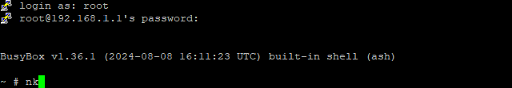

И нажимаем ввод.

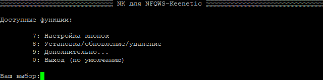

## Давайте установим NFQWS-Keenetic.

Выбираем "8: Установка/обновление/удаление"

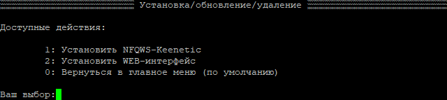

Выбираем "1: Установить NFQWS-Keenetic"

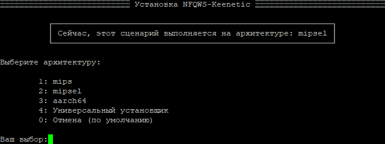

Выбираем архитектуру (или "4: Универсальный установщик")

<details><summary>Будет выполнена установка пакета "NFQWS-Keenetic"...</summary>
 
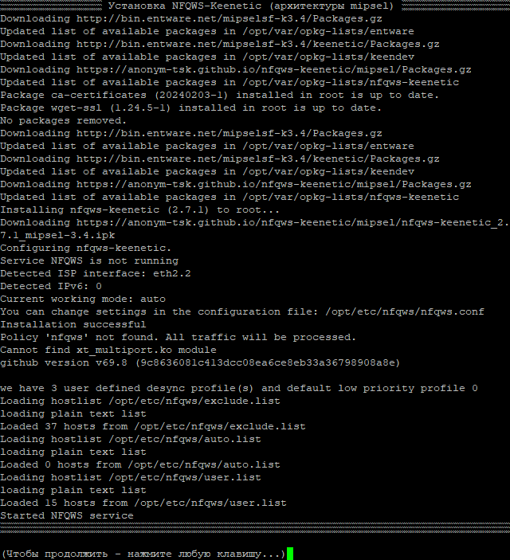
 
</details>

По итогам установки, число доступных действий (в NK) - существенно увеличивается...

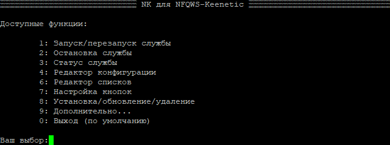

## Редактор конфигурации.

Если выбрать "4: Редактор конфигурации" - можно просмотреть и внести изменения в ткуцщцю конфигурацию NFQWS-Keenetic...

<details><summary>(большой скриншот)</summary></summary>
 
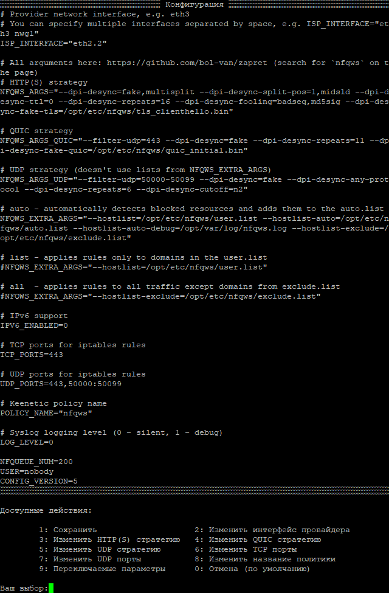
 
</details>

№№ Редактор списков.

Если-же выбрать "6: Редактор списков" - можно добавлять и удалять строки из списков (использующихся для определения необходимости применения стратегий к тем или инымзапросам)...

Для начала - выбираем список (который нужно просмотреть/отредактировать).

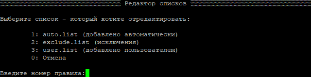

А затем - выполняем все необходимые действия...

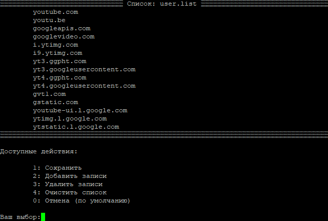
 
(Например) добавим в список "example.com"...

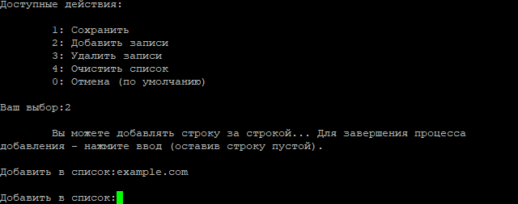

И как результат:

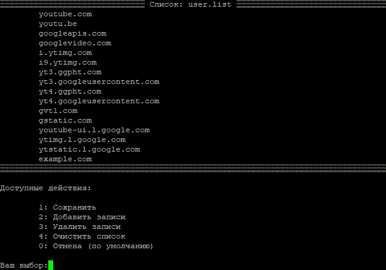

## Ключи.

NK - поддерживает работу с ключами (что позволяет выполнять некоторые действия без использования начального меню). Например:

````
nk -r
````
Перезапустит службу NFQWS (для применения новых настроек).
> Что существенно удобнее и быстрее - чем каждый раз набирать "/opt/etc/init.d/S51nfqws restart"...

Ниже приведён список ключей и их описание:

- -a: Вывод в терминал архитектуры процессора - на котором выполняется сценарий.
- -A: Установка пакета NFQWS-Keenetic для архитектуры aarch64
- -b: Резервное копирование/восстановление файлов профиля (конфигурация, списки и т.п.)
- -B: Настройка кнопок маршрутизатора (для управления службой NFQWS)
- -с: Редактор конфигурации
- -i: Информация об установленном пакете NFQWS-Keenetic
- -I: Установка универсального пакета NFQWS-Keenetic
- -l: Редактор списков
- -m: Установка пакета NFQWS-Keenetic для архитектуры mips
- -M: Установка пакета NFQWS-Keenetic для архитектуры mipsel
- -o: Оптимизация профиля (помогает избавиться от лишних файлов и восстановить некоторые параметры - после обновления NFQWS-Keenetic)
- -r: Перезапуск службы NFQWS
- -R: Удаление пакета NFQWS-Keenetic
- -s: Остановка службы NFQWS
- -S: Запуск службы NFQWS 
- -u: Обновление скрипта NK (до последней версии)
- -U: Обновление пакета NFQWS-Keenetic
- -v: Вывод в терминал текущей версии NK 
- -W: Установка Web-интерфейса NFQWS-Keenetic
- -z: Предварительная настройка маршрутизаторов ZyXel Keenetic с KeeneticOS 2.x

## P.S.
Если после установки NFQWS-Keenetic, у вас возникли проблемы: обратитесь к разделу:  (на странице разработчика)...
