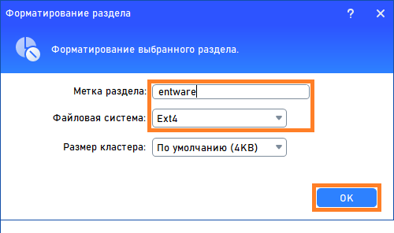
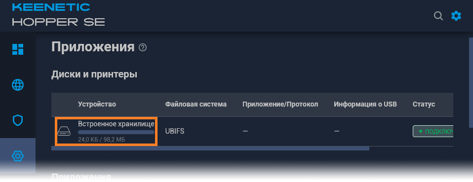
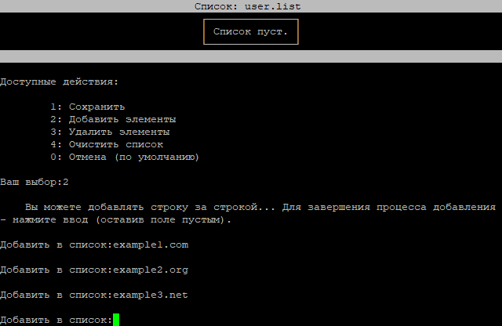

# NK для [NFQWS-Keenetic](https://github.com/Anonym-tsk/nfqws-keenetic)
Небольшая надстройка, позволяющая упростить и сделать максимально дружелюбным - процесс установки, настройки и эксплуатации...

## Установка.
<details><summary>Для тех, кто начинает с самого начала (установка Entware)</summary>
┉┉┉┉┉┉┉┉┉┉┉┉┉┉┉┉┉┉┉┉┉┉┉┉┉┉┉┉┉┉┉┉┉┉┉┉┉┉┉┉┉┉┉┉┉┉┉┉┉┉┉┉┉┉┉┉

 ▪ Нам понадобится интернет-центр Keenetic (или ZyXel Keenetic) с USB-портом(ами) и поддержкой работы с накопителями...

> К таковым не относятся устройства: 4G II, 4G III, а также бюджетные модели 2024-го года (уточняйте поддержку соответствующих функций на сайте производителя).

▪ Для начала - нужно войти в веб-конфигуратор (попасть в него можно, набрав в адресной строке браузера):

```
my.keenetic.net
```

или адрес интернет-центра (в сегменте - к которому подключено ваше устройство). В "домашней сети" это обычно:

```
192.168.1.1
```

<details><summary>Если у вас ZyXel Keenetic (с KeeneticOS версии 2.x)</summary>
┉┉┉┉┉┉┉┉┉┉┉┉┉┉┉┉┉┉┉┉┉┉┉┉┉┉┉┉┉┉┉┉┉┉┉┉┉┉┉┉┉┉┉┉┉┉┉┉┉
 
 ▪ Открываем (в веб-конфигураторе) интерфейс командной строки, обычно это:
 
```
http://192.168.1.1/a
```

И вводим в поле "Command" одну из следующих команд:

```
components sync legacy
```

> (для KeeneticOS до версии 2.06)

```
components list legacy
```

> (для KeeneticOS версии 2.06 и выше)

▪ Нажимаем кнопку "Отправить запрос".

▪ Затем, переходим в "Управление/Параметры системы", проверяем наличие обновлений KeeneticOS, и если таковые есть - устанавливаем их...
</details>

▪ (В веб-конфигураторе) переходим в "Управление/Параметры системы", нажимаем "Изменить набор компонентов"...

<details><summary>(показать скриншот)</summary>

</details>

▪ Устанавливаем/убеждаемся, что установлен следующий компонент:

```
Поддержка открытых пакетов
```

<details><summary>(показать скриншот)</summary>

</details>

> Чтобы упростить поиск нужных компонентов в списке - можно воспользоваться полем "Поиск" (Поиск компонентов по имени)...

> Если компонент не установлен, в процессе установки - интернет-центр будет перезагружен...

▪ Теперь нужно определиться - где будет установлен Entware: во встроенном хранилище или на USB-накопителе. Нужно учитывать что: сам Entware - занимает около 8-ми MB, также понадобится свободное место для установки дополнительных пакетов...
- Встроенное хранилище - всегда с интернет-центром, не отключится (по каким-то своим причинам), не занимает USB-порт. Но - имеет существенные ограничения по объёму, и (теоретически) чувствительно к постоянной перезаписи данных (флеш-память имеет свойство изнашиваться, в связи с чем - крайне рекомендуется (по возможности) избегать ведение логов (с сохранением данных на встроенное хранилище))...
- USB-накопитель - может существенно превышать встроенное хранилище по объёму, может быть легко заменён (в случае каких-либо проблем). Но - занимает USB-порт, может быть медленнее встроенного хранилища (в зависимости от типа интерфейса/накопителя), может неожиданно оказаться отключенным (из за перегрева, механического воздействия или каких-то других причин)...
> USB-накопитель - желательно отформатировать в ext4 ( под Windows, это можно сделать с помощью бесплатной [AOMEI Partition Assistant Standard Edition](https://www.aomeitech.com/pa/standard.html). В процессе форматирования, следует задать разделу на USB-накопителе - какую-нибудь метку тома (например "entware")...

<details><summary>(показать скриншоты)</summary>





</details>

▪ Скачиваем дистрибутив Entware (подходящий для архитектуры процессора вашего интернет-центра):
- [mipsel](https://bin.entware.net/mipselsf-k3.4/installer/mipsel-installer.tar.gz)
- [mips](https://bin.entware.net/mipssf-k3.4/installer/mips-installer.tar.gz)
- [aarch64](https://bin.entware.net/aarch64-k3.10/installer/aarch64-installer.tar.gz)

> Определить, архитектуру процессора вашего устройства - не так просто (как хотелось бы)...

▪ Открываем интерфейс командной строки (обычно это):

```
http://192.168.1.1/a
```

▪ Вводим следующую команду:

```
show version
```

▪ Нажимаем кнопку "Отправить запрос"...

<details><summary>(показать скриншот)</summary>

</details>

В отчёте (об установленной версии KeeneticOS) – будет строка: "arch": "*****" (где ***** - указание на архитектуру процессора). Если архитектура: aarch64 - можно смело качать и устанавливать соответствующий дистрибутив Entware. Если: mips - придётся воспользоваться интернетом для уточнения: mips или mipsel...

<details><summary>(показать скриншот)</summary>

</details>

> Если у вас актуальная модель интернет-центра – соответствие архитектуры конкретным моделям можно посмотреть [здесь]( https://help.keenetic.ru/hc/ru/articles/360021214160.html).

▪ Переходим в "Управление/Приложения" (в веб-конфигураторе). В разделе "Диски и принтеры" - открываем накопитель (на который будем устанавливать Entware)...

<details><summary>(показать скриншот)</summary>

</details>

▪ Выделяем раздел (в дереве папок) и нажимаем кнопку "Создать папку в выделенной папке"...

<details><summary>(показать скриншот)</summary>

</details>

▪ Создаём в корне диска папку "install" (все буквы в её имени - должны быть строчными)...

<details><summary>(показать скриншот)</summary>

</details>

▪ Выделяем папку "install" и нажимаем кнопку "Загрузить файл в выбранную папку"...

<details><summary>(показать скриншот)</summary>

</details>

▪ (Находим в проводнике, выбираем и) помещаем скачанный архив (с дистрибутивом Entware) в неё...

<details><summary>(показать скриншот)</summary>

</details>

▪ Затем, переходим в "Управление/OPKG", в меню "Накопитель" - выбираем диск (на который загрузили дистрибутив Entware), и нажимаем "Сохранить"...

<details><summary>(показать скриншот)</summary>

</details>

> Дожидаемся, когда побледневшая кнопка "Сохранить" полностью исчезнет…

▪ Переходим в "Управление/Диагностика", где нажимаем "Показать журнал".

<details><summary>(показать скриншот)</summary>

</details>

▪ В журнале (одно за другим) будут появляться события (связанные с установкой и настройкой различных компонентов Entware), мы ждём события "Установка системы пакетов Entware - завершена"...

<details><summary>(показать скриншот)</summary>

</details>

<details><summary>Теперь нам понадобится ПК и PuTTY</summary>
┉┉┉┉┉┉┉┉┉┉┉┉┉┉┉┉┉┉┉┉┉┉┉┉┉┉┉┉┉┉┉┉┉┉┉┉
 
▪ [Скачиваем](http://www.putty.org/), устанавливаем и запускаем PuTTY...


▪ В поле "Host Name (or IP adress)" - вводим IP-адрес вашего маршрутизатора, обычно это:

```
192.168.1.1
```

▪ В поле "Port" - оставляем:

```
22
```

> (или вводим "222", если до установки Entware в прошивке уже был установлен компонент "Сервер SSH")

<details><summary>(показать скриншот)</summary>

</details>

▪ Нажимаем кнопку "Open"...

> (При первом подключении) появится окошко с предупреждением - в котором нужно нажать "Accept".

<details><summary>(показать скриншот)</summary>

</details>
 
▪ Откроется окно терминала. На запрос имени пользователя (login as) вводим:

```
root
```

▪ Нажимаем ввод...

▪ На запрос пароля (root@192.168.1.1's password) - вводим:

```
keenetic
```

> (при вводе пароля - символы отображаться не будут).

> Если у вас возникают сложности с вводом пароля - его можно скопировать из блокнота (или из этой инструкции) и вставить в окно терминала (кликом правой кнопки мыши)...

▪ Нажимаем "ввод"...
<details><summary>(показать скриншот)</summary>

</details>

▪ Если всё правильно - появится приглашение для ввода команд...

``
~ #
``

<details><summary>(показать скриншот)</summary>

</details>
</details>

<details><summary>Если ПК под рукой нет (но есть смартфон)</summary>
 ┉┉┉┉┉┉┉┉┉┉┉┉┉┉┉┉┉┉┉┉┉┉┉┉┉┉┉┉┉┉┉┉┉┉┉┉┉┉┉┉┉┉

 ▪ Устанавливаем ConnectBot из [GooglePlay](https://play.google.com/store/apps/details?id=org.connectbot) или [RuStore](https://www.rustore.ru/catalog/app/org.connectbot) и открываем его...

▪ Нажимаем кнопку "+" (в нижней части экрана)...

<details><summary>(показать скриншот)</summary>

</details>

▪ Нажимаем на направленную вниз галку (справа от поля)...

<details><summary>(показать скриншот)</summary>

</details>

▪ Заполняем поля "Имя пользователя", "Сервер" и "Порт" - следующими данными:

Имя пользователя:

```
root
```

Сервер - адрес вашего интернет-центра (обычно это):
```
192.168.1.1
```

Порт:

```
22
```

> (или вводим "222", если до установки Entware в прошивке уже был установлен компонент "Сервер SSH")

<details><summary>(показать скриншот)</summary>

</details>

▪ Нажимаем кнопку "Назад"...

▪ Возвращаемся к списку серверов и выбираем (добавленное) подключение...

<details><summary>(показать скриншшот)</summary>

</details>

▪ Соглашаемся "продолжить попытки соединений"...

<details><summary>(показать скриншот)</summary>

</details>

▪ Вводим пароль:

```
keenetic
```

<details><summary>(показать скриншот)</summary>

</details>

▪ Нажимаем ввод...

▪ Если всё правильно - появится приглашение для ввода команд...

``
 ~ #
 ``

<details><summary>(показать скриншот)</summary>

</details>
</details>
</details>

<details><summary>Чтобы всё правильно работало (необходимые компоненты и настройки)</summary>
┉┉┉┉┉┉┉┉┉┉┉┉┉┉┉┉┉┉┉┉┉┉┉┉┉┉┉┉┉┉┉┉┉┉┉┉┉┉┉┉┉┉┉┉┉┉┉┉┉┉┉┉┉┉┉┉┉┉┉┉┉┉┉┉┉┉┉┉┉┉
 
 ▪ Понадобятся следующие компоненты:
```
Прокси-сервер DNS-over-TLS
```
```
Прокси-сервер DNS-over-HTTPS
```
```
Протокол IPv6
```
```
 Модули ядра подсистемы Netfilter
```
```
Пакет расширения Xtables-addons для Netfilter
```

> Чтобы упростить поиск нужных компонентов в списке - можно воспользоваться полем "Поиск" (Поиск компонентов по имени)...

> Некоторые компоненты - могут не отображаться в списке, пока не будут выбраны/установлены другие...

▪ Устанавливаем недостающие, перезагружаемся и проверяем (все ли необходимые компоненты установились)...

> Если уже установлено слишком много компонентов - новым может просто не хватать свободного места. В этом случае, придётся отключить какие-нибудь неиспользуемые компоненты...

▪ В "Сетевые правила/Интернет-фильтры/Настройка DNS" - нужно добавить несколько DoT/DoH серверов: "Добавить сервер" (Тип сервера DNS: "DNS-over-TLS" или "DNS-over-HTTPS")...

> У автора этих строк - добавлены следующие DoT):

````
1.1.1.1
````
> (Cloudflare)
````
8.8.8.8
````
> (Google)
````
77.88.8.8
````
> (Яndex)

> Если вам известны другие DoT/DoH - можете использовать их...

<details><summary>Если у вас ZyXel Keenetic (с KeeneticOS версии 2.x)...</summary>
 ┉┉┉┉┉┉┉┉┉┉┉┉┉┉┉┉┉┉┉┉┉┉┉┉┉┉┉┉┉┉┉┉┉┉┉┉┉┉┉┉┉┉┉┉┉┉┉┉┉
 
Чтобы компенсировать отсутствие DoT и DoH в KeeneticOS 2.x (если это необходимо) - вы можете воспользоваться пунктом "Донастройка ZyXel Keenetic" (находящемся в разделе "Дополнительно", скрипта NK)...
</details>
</details>

Для того чтобы начать пользоваться NK - достаточно скопировать следующие несколько команд:

````
opkg update
opkg install ca-certificates wget-ssl
opkg remove wget-nossl
wget -O /opt/bin/nk https://raw.githubusercontent.com/Neytrino-OnLine/NK/refs/heads/main/nk.sh
chmod +x /opt/bin/nk

````
> Вставить их в PuTTY можно - кликом правой кнопки мыши (по окну терминала), В ConnectBot - можно использовать кнопку "Вставить" (на верхней панели)...

По завершению процесса - вводим в терминал:
```
nk
```

И нажимаем "ввод"...


<details><summary>Что можно сделать с помощью NK...</summary>
┉┉┉┉┉┉┉┉┉┉┉┉┉┉┉┉┉┉┉┉┉┉┉┉┉┉┉┉┉┉┉┉┉┉┉┉┉
 
#### Можно изменить какую-нибудь настройку (например "режим работы")...

▪ В главном меню - выбираем "Редактор конфигурации" (5)


▪ В редакторе - выбираем "Переключаемые параметры" (9)


▪ В меню "Переключаемые параметры" - выбираем "Режим работы" (1)


 
▪ В меню "Режим работы" - выбираем "Список" (2)


> Обратите внимание: перед параметром "NFQWS_EXTRA_ARGS" отвечающим за режим "auto" - появился коментирующий символ "#", а у аналогичного параметра, отвечающего за режим "list" - он исчез...

▪ Сохраняем изменения (1), перезапускаем службу (1)...

> При каждом сохранении файла конфигурации, NK - делает резервную копию его предыдущей версии, помещая её в папку с текущей датой и временем в названии (чтобы иметь возможность быстро восстановить предыдущее состояние)...

#### Можно добавлять/удалять доменные имена (в одном из файлов-списков)...

▪ В главном меню - выбираем "Редактор списков" (7)


 
▪ В меню - выбираем один из списков (например) "user.list" (3)



▪ В редакторе выбираем "Добавить элементы" (2), и последовательно добавляем желаемые домены. Чтобы завершить добавление - нажимаем "ввод" (оставив поле пустым)...


 
▪ Если есть необходимость удалить доменные имена из списка - выбираем "Удалить элементы", вводим последовательность символов (соответствующую записям - которые нужно удалить), убеждаемся что среди найденых строк - нет лишних,  и соглашаемся на их удаление (1)


▪ Завершив редактирование списка - сохраняем его (1), и перезапускаем службу (1)...

> При каждом сохранении файлов списков, NK - делает резервные копии их предыдущих версий, помещая их в папку с текущей датой и временем в названии (чтобы иметь возможность быстро восстановить предыдущее состояние)...

#### Ключи.

NK - поддерживает работу с ключами (что позволяет выполнять некоторые действия без использования начального меню). Например:

````
nk -r
````
Перезапустит службу NFQWS (для применения новых настроек).
> Что существенно удобнее и быстрее - чем каждый раз набирать "/opt/etc/init.d/S51nfqws restart"...

Ниже приведён список ключей и их описание:

- -a: Вывод в терминал архитектуры процессора - на котором выполняется сценарий.
- -A: Установка пакета NFQWS-Keenetic для архитектуры aarch64
- -b: Резервное копирование/восстановление файлов профиля (конфигурация, списки и т.п.)
- -B: Настройка кнопок маршрутизатора (для управления службой NFQWS)
- -с: Редактор конфигурации
- -f: Имитация первого запуска (диалог быстрой установки NFQWS-keenetic)
- -i: Информация об установленном пакете NFQWS-Keenetic
- -I: Установка универсального пакета NFQWS-Keenetic
- -l: Редактор списков
- -m: Установка пакета NFQWS-Keenetic для архитектуры mips
- -M: Установка пакета NFQWS-Keenetic для архитектуры mipsel
- -o: Оптимизация профиля (помогает избавиться от лишних файлов и восстановить некоторые параметры - после обновления NFQWS-Keenetic)
- -p: Запуск NK без проверки наличия обновлений NFQWS-Keenetic
- -P: Управление политикой доступа
- -r: Перезапуск службы NFQWS
- -R: Удаление пакета NFQWS-Keenetic
- -s: Остановка службы NFQWS
- -S: Запуск службы NFQWS 
- -u: Обновление скрипта NK (до последней версии)
- -U: Обновление пакета NFQWS-Keenetic
- -v: Вывод в терминал текущей версии NK 
- -W: Установка Web-интерфейса NFQWS-Keenetic
- -z: Донастройка интернет-центров ZyXel Keenetic (с KeeneticOS 2.x, в которых недоступны DoT и DoH)

#### P.S.
Если после установки NFQWS-Keenetic, у вас возникли проблемы с основным функционалом пакета - обратитесь к разделу:  (на странице разработчика)...
</details>
